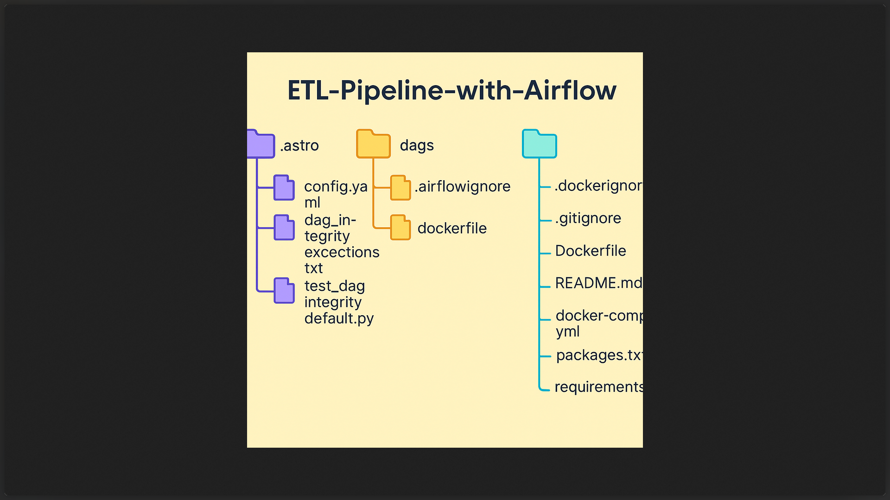
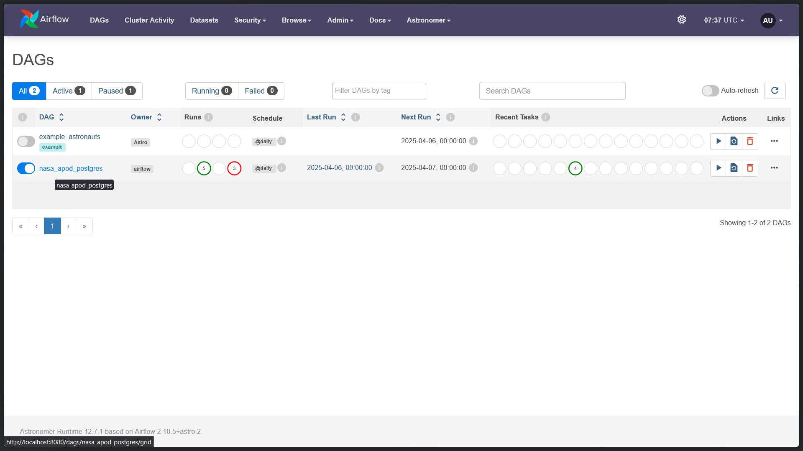
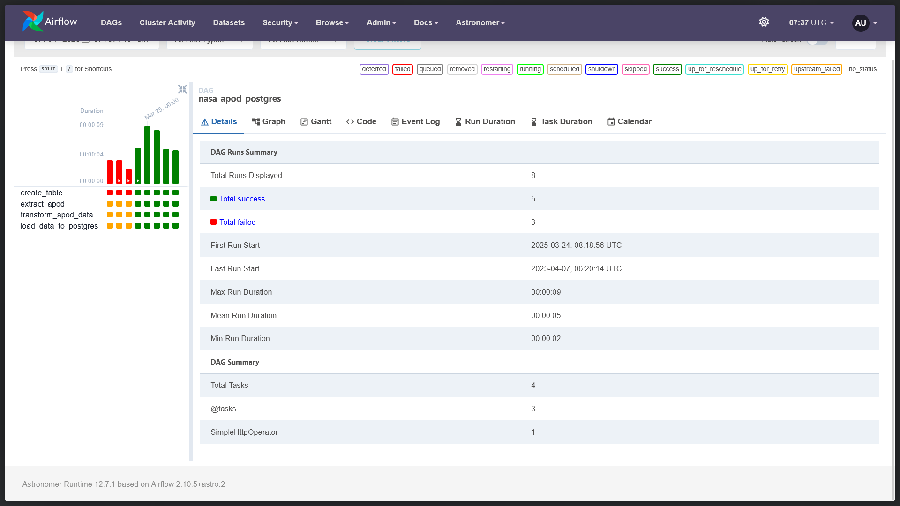

# ETL Pipeline with Apache Airflow

This project demonstrates an ETL (Extract, Transform, Load) pipeline orchestrated using **Apache Airflow**. It includes DAG definitions, tests, Docker containerization, and visualization diagrams of both the structure and the output.

---

## 📁 Project Structure

```plaintext
ETL-Pipeline-with-Airflow/
├── .astro/
│   ├── config.yaml
│   ├── dag_integrity_exceptions.txt
│   └── test_dag_integrity_default.py
├── dags/
│   ├── .airflowignore
│   ├── etl.py
│   └── exampledag.py
├── tests/
│   └── dags/
│       └── test_dag_example.py
├── assets/
│   ├── diagram1.png     # Project structure diagram
│   ├── diagram2.png     # Output visualization 1
│   └── diagram3.png     # Output visualization 2
├── .dockerignore
├── .gitignore
├── Dockerfile
├── README.md
├── docker-compose.yml
├── packages.txt
└── requirements.txt
```

---

## 🚀 Features

- 📦 Containerized with Docker
- 📋 Clean DAG structure with `.airflowignore` and unit tests
- 🧪 Testing DAGs with Astro-integrated test suite
- 🧰 Modular, extensible setup
- 🧼 Auto cleanup and ignore rules with `.gitignore` and `.dockerignore`

---

## 🧠 How It Works

- **ETL DAGs**: Defined in the `dags/` folder, automating data extraction, transformation, and loading.
- **Airflow Integration**: Using `docker-compose` for orchestration and Astro for enhanced Airflow features.
- **Testing**: Unit tests using Python located under `tests/`.

---

## 🖼️ Diagrams

### 📌 Project Structure


### 📌 Output Sample 1


### 📌 Output Sample 2


---

## 🛠️ Tech Stack

- **Apache Airflow**
- **Docker & Docker Compose**
- **Python 3.x**
- **Astro CLI (optional)**
- **VS Code / any IDE**

---

## 🏃‍♂️ Getting Started

```bash
# 1. Clone the repository
git clone https://github.com/Aaron2Rodrigues/ETL-Pipeline-with-Airflow.git
cd ETL-Pipeline-with-Airflow

# 2. Start Docker services
docker-compose up --build

# 3. Access Airflow at
http://localhost:8080
```

---

## ✅ Author

**Chris Aaron Rodrigues**  
🔗 [GitHub](https://github.com/Aaron2Rodrigues)

---

## 📄 License

This project is licensed under the MIT License.
